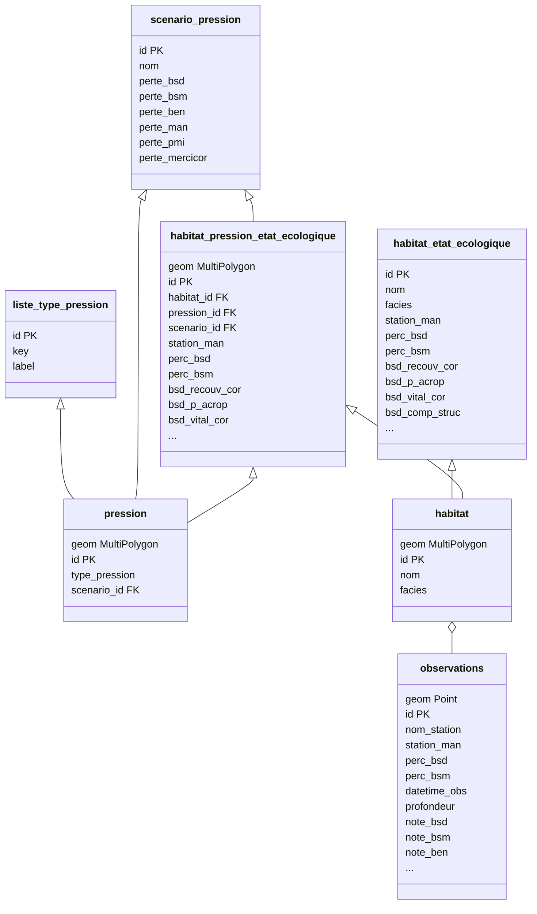

---
hide:
  - navigation
---

# Modèle de données

## Relations

??? info "Légende"
    Flèche pleine : relation de projet

    Losange vide : jointure spatiale

## Tables

??? info "Légende"
    Champ géométrique en *italique*

    Champ de clé primaire en **gras**

    Champ de clé étrangère cliquable avec la mention "FK"

### Habitat Pression Etat Ecologique

| ID | Name | Type | Alias |
|:-:|:-:|:-:|:-:|
||*geom*|MultiPolygon||
|1|**id**|qlonglong|Identifiant|
|2|[habitat_id FK](#habitat)|qlonglong|Identifiant habitat|
|3|[pression_id FK](#pression)|qlonglong|Identifiant de pression|
|4|[scenario_id FK](#scenario-pression)|qlonglong|Identifiant du scenario de pression|
|5|station_man|bool|Stations en Mangrove|
|6|perc_bsd|double|Pourcentage Benthique de substrats durs|
|7|perc_bsm|double|Pourcentage Benthique de substrats meubles|
|8|bsd_recouv_cor|double|Recouvrement corallien (Scléractiniaires)|
|9|bsd_p_acrop|double|Pourcentage du recouvrement corallien représenté par les coraux acropores|
|10|bsd_vital_cor|double|Vitalité et taux de mortalité corallienne|
|11|bsd_comp_struc|double|Complexité structurelle des peuplements coralliens|
|12|bsd_taille_cor|double|Taille des coraux vivants|
|13|bsd_dens_juv|double|Densité de coraux juvéniles|
|14|bsd_f_sessile|double|Recouvrement par la faune sessile non corallienne|
|15|bsd_recouv_ma|double|Recouvrement par les macroalgues|
|16|bsm_fragm_herb|double|Fragmentation de l’herbier|
|17|bsm_recouv_her|double|Recouvrement par l’herbier (patchs)|
|18|bsm_haut_herb|double|Hauteur de l’herbier (patchs)|
|19|bsm_dens_herb|double|Densité des phanérogames (patchs)|
|20|bsm_div_herb|double|Diversité spécifique des phanérogames (patchs)|
|21|bsm_epibiose|double|Epibiose de l’herbier (patchs)|
|22|man_fragm|double|Fragmentation de la mangrove|
|23|man_recouv|double|Recouvrement par la mangrove (patchs)|
|24|man_diam_tronc|double|Diamètre des troncs (patchs)|
|25|man_dens|double|Densité des palétuviers (patchs)|
|26|man_diversit|double|Diversité spécifique des palétuviers (patchs)|
|27|man_vital|double|Vitalité des palétuviers (patchs)|
|28|pmi_div_poi|double|Diversité spécifique des peuplements de poissons|
|29|pmi_predat_poi|double|Abondance et maturité des prédateurs supérieurs récifaux|
|30|pmi_scarib_poi|double|Abondance et maturité des poissons perroquets|
|31|pmi_macro_inv|double|Abondance des macro-invertébrés|
|32|note_bsd|double|Note Mercicor Benthique de substrats durs|
|33|note_bsm|double|Note Mercicor Benthique de substrats meubles|
|34|note_ben|double|Note Mercicor Benthique|
|35|note_man|double|Note Mercicor Mangrove|
|36|note_pmi|double|Note Mercicor Poissons et Macro-invertébrés|
|37|score_mercicor|double|Score Mercicor|

### Pression

| ID | Name | Type | Alias |
|:-:|:-:|:-:|:-:|
||*geom*|MultiPolygon||
|1|**id**|qlonglong|ID|
|2|type_pression|qlonglong|Type de pression|
|3|[scenario_id FK](#scenario-pression)|qlonglong|ID Scénario|

### Habitat

| ID | Name | Type | Alias |
|:-:|:-:|:-:|:-:|
||*geom*|MultiPolygon||
|1|**id**|qlonglong|Id|
|2|nom|QString|Nom|
|3|facies|QString|Faciès|

### Scenario Pression

| ID | Name | Type | Alias |
|:-:|:-:|:-:|:-:|
|1|**id**|qlonglong|Identifiant|
|2|nom|QString|libellé du scenario|
|3|perte_bsd|double|Perte Mercicor Benthique de substrats durs|
|4|perte_bsm|double|Perte Mercicor Benthique de substrats meubles|
|5|perte_ben|double|Perte Mercicor Benthique|
|6|perte_man|double|Perte Mercicor Mangrove|
|7|perte_pmi|double|Perte Mercicor Poissons et Macro-invertébrés|
|8|perte_mercicor|double|Perte Mercicor|

### Liste Type Pression

| ID | Name | Type | Alias |
|:-:|:-:|:-:|:-:|
|1|**id**|qlonglong|Id|
|2|key|qlonglong|Clé|
|3|label|QString|Étiquette|

### Observations

| ID | Name | Type | Alias |
|:-:|:-:|:-:|:-:|
||*geom*|Point||
|1|**id**|qlonglong|Id|
|2|nom_station|QString|Nom de la station d'observations|
|3|station_man|bool|Station en Mangrove|
|4|perc_bsd|double|Pourcentage Benthique de substrats durs |
|5|perc_bsm|double|Pourcentage Benthique de substrats meubles|
|6|datetime_obs|QDateTime|Date et heure d'observations|
|7|profondeur|double|Profondeur|
|8|note_bsd|double|Note Mercicor Benthique de substrats durs|
|9|note_bsm|double|Note Mercicor Benthique de substrats meubles|
|10|note_ben|double|Note Mercicor Benthique|
|11|note_man|double|Note Mercicor Mangrove|
|12|note_pmi|double|Note Mercicor Poissons et Macro-invertébrés|
|13|score_mercicor|double|Score Mercicor|
|14|phch_temp|double|Température de l'eau|
|15|phch_dop|double|Oxygène dissous en pourcentage|
|16|phch_do|double|Oxygène dissous en mg/L|
|17|phch_cond|double|Conductivité en ms par cm|
|18|phch_sal|double|Salinité de l'eau|
|19|phch_ph|double|PH de l'eau|
|20|phch_turb|double|Turbidité de l'eau|
|21|phch_sedi|double|Sédimentation|
|22|bsd_recouv_cor|double|Recouvrement corallien (Scléractiniaires)|
|23|bsd_p_acrop|double|Pourcentage du recouvrement corallien représenté par les coraux acropores|
|24|bsd_vital_cor|double|Vitalité et taux de mortalité corallienne|
|25|bsd_comp_struc|double|Complexité structurelle des peuplements coralliens|
|26|bsd_taille_cor|double|Taille des coraux vivants|
|27|bsd_dens_juv|double|Densité de coraux juvéniles|
|28|bsd_f_sessile|double|Recouvrement par la faune sessile non corallienne|
|29|bsd_recouv_ma|double|Recouvrement par les macroalgues|
|30|bsm_fragm_herb|double|Fragmentation de l’herbier|
|31|bsm_recouv_her|double|Recouvrement par l’herbier (patchs)|
|32|bsm_haut_herb|double|Hauteur de l’herbier (patchs)|
|33|bsm_dens_herb|double|Densité des phanérogames (patchs)|
|34|bsm_div_herb|double|Diversité spécifique des phanérogames (patchs)|
|35|bsm_epibiose|double|Epibiose de l’herbier (patchs)|
|36|man_fragm|double|Fragmentation de la mangrove|
|37|man_recouv|double|Recouvrement par la mangrove (patchs)|
|38|man_diam_tronc|double|Diamètre des troncs (patchs)|
|39|man_dens|double|Densité des palétuviers (patchs)|
|40|man_diversit|double|Diversité spécifique des palétuviers (patchs)|
|41|man_vital|double|Vitalité des palétuviers (patchs)|
|42|pmi_div_poi|double|Diversité spécifique des peuplements de poissons|
|43|pmi_predat_poi|double|Abondance et maturité des prédateurs supérieurs récifaux|
|44|pmi_scarib_poi|double|Abondance et maturité des poissons perroquets|
|45|pmi_macro_inv|double|Abondance des macro-invertébrés|

### Habitat Etat Ecologique

| ID | Name | Type | Alias |
|:-:|:-:|:-:|:-:|
|1|**id**|qlonglong|Identifiant|
|2|nom|QString|Nom de l'habitat|
|3|facies|QString|Faciès de l'habitat|
|4|station_man|bool|Stations en Mangrove|
|5|perc_bsd|double|Pourcentage Benthique de substrats durs|
|6|perc_bsm|double|Pourcentage Benthique de substrats meubles|
|7|bsd_recouv_cor|double|Recouvrement corallien (Scléractiniaires)|
|8|bsd_p_acrop|double|Pourcentage du recouvrement corallien représenté par les coraux acropores|
|9|bsd_vital_cor|double|Vitalité et taux de mortalité corallienne|
|10|bsd_comp_struc|double|Complexité structurelle des peuplements coralliens|
|11|bsd_taille_cor|double|Taille des coraux vivants|
|12|bsd_dens_juv|double|Densité de coraux juvéniles|
|13|bsd_f_sessile|double|Recouvrement par la faune sessile non corallienne|
|14|bsd_recouv_ma|double|Recouvrement par les macroalgues|
|15|bsm_fragm_herb|double|Fragmentation de l’herbier|
|16|bsm_recouv_her|double|Recouvrement par l’herbier (patchs)|
|17|bsm_haut_herb|double|Hauteur de l’herbier (patchs)|
|18|bsm_dens_herb|double|Densité des phanérogames (patchs)|
|19|bsm_div_herb|double|Diversité spécifique des phanérogames (patchs)|
|20|bsm_epibiose|double|Epibiose de l’herbier (patchs)|
|21|man_fragm|double|Fragmentation de la mangrove|
|22|man_recouv|double|Recouvrement par la mangrove (patchs)|
|23|man_diam_tronc|double|Diamètre des troncs (patchs)|
|24|man_dens|double|Densité des palétuviers (patchs)|
|25|man_diversit|double|Diversité spécifique des palétuviers (patchs)|
|26|man_vital|double|Vitalité des palétuviers (patchs)|
|27|pmi_div_poi|double|Diversité spécifique des peuplements de poissons|
|28|pmi_predat_poi|double|Abondance et maturité des prédateurs supérieurs récifaux|
|29|pmi_scarib_poi|double|Abondance et maturité des poissons perroquets|
|30|pmi_macro_inv|double|Abondance des macro-invertébrés|
|31|note_bsd|double|Note Mercicor Benthique de substrats durs|
|32|note_bsm|double|Note Mercicor Benthique de substrats meubles|
|33|note_ben|double|Note Mercicor Benthique|
|34|note_man|double|Note Mercicor Mangrove|
|35|note_pmi|double|Note Mercicor Poissons et Macro-invertébrés|
|36|score_mercicor|double|Score Mercicor|
