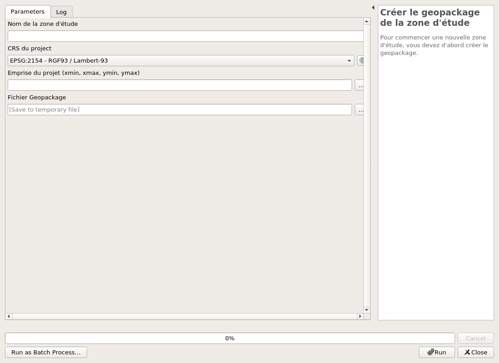
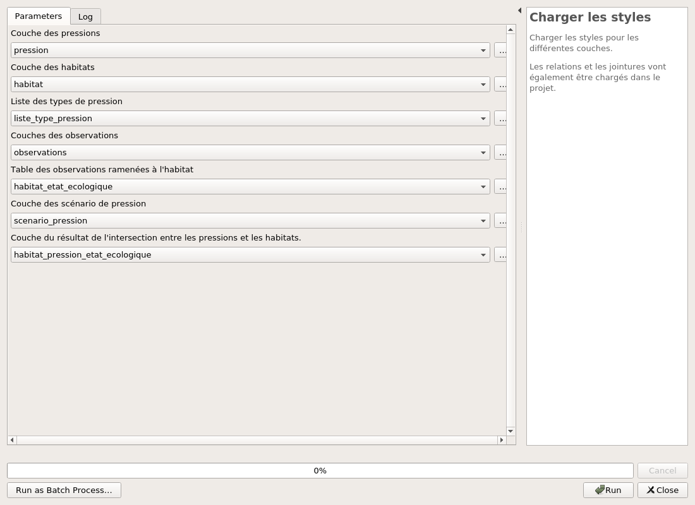
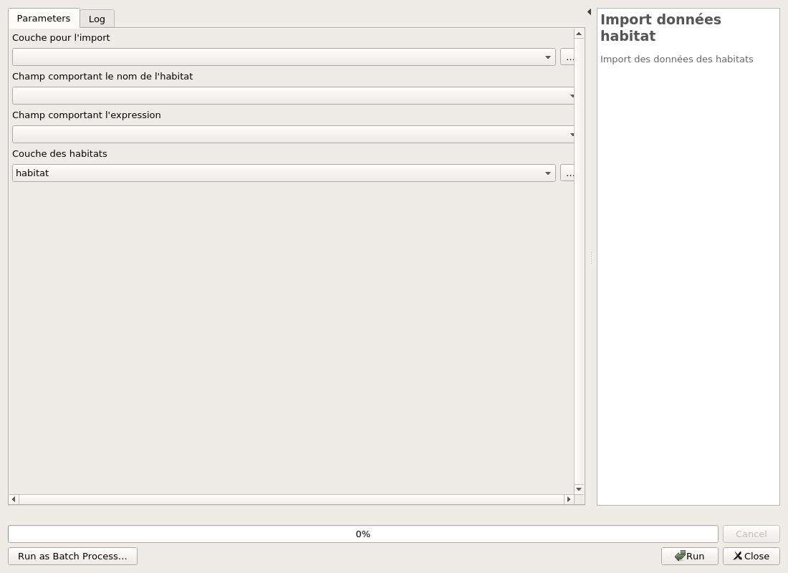
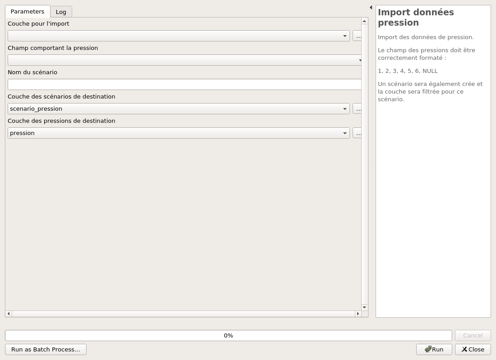

---
hide:
  - navigation
---

# Processing

## Administration

### Create geopackage project

To start a blank new project, you need to create first a geopackage file.

#### Parameters

| ID | Description | Type | Info | Required | Advanced | Option |
|:-:|:-:|:-:|:-:|:-:|:-:|:-:|
FILE_GPKG|Geopackage File|FileDestination||✓|||
PROJECT_NAME|Project name|String||✓|||
PROJECT_CRS|Project CRS|Crs||✓||Default: EPSG:2154   |
PROJECT_EXTENT|Project extent|Extent||✓|||

#### Outputs

| ID | Description | Type | Info |
|:-:|:-:|:-:|:-:|
FILE_GPKG|Geopackage File|File||
OUTPUT_LAYERS|Couches de sorties|MultipleLayers||

***

### Charger les styles

Charger les styles pour les différentes couches.

Les relations vont aussi être chargés dans le projet.

#### Parameters

| ID | Description | Type | Info | Required | Advanced | Option |
|:-:|:-:|:-:|:-:|:-:|:-:|:-:|
PRESSURE_LAYER|Couche des pressions|VectorLayer||✓||Default: pression   Type: TypeVectorPolygon  |
HABITAT_LAYER|Couche des habitats|VectorLayer||✓||Default: habitat   Type: TypeVectorPolygon  |
PRESSURE_LIST_LAYER|Liste des types de pression|VectorLayer||✓||Default: liste_type_pression   Type: TypeVectorPolygon  |
HABITAT_LIST_LAYER|Liste des types d'habitat|VectorLayer||✓||Default: liste_sante   Type: TypeVectorPolygon  |

#### Outputs

| ID | Description | Type | Info |
|:-:|:-:|:-:|:-:|
RELATIONS_ADDED|Nombre de relations chargés|Number||
QML_LOADED|Nombre de QML chargés|Number||

***

## Import

### Import données habitat

Import des données des habitats

#### Parameters

| ID | Description | Type | Info | Required | Advanced | Option |
|:-:|:-:|:-:|:-:|:-:|:-:|:-:|
INPUT_LAYER|Couche pour l'import|VectorLayer||✓||Type: TypeVectorPolygon  |
NAME_FIELD|Champ comportant le nom de l'habitat|Field||✓|||
EXPRESSION_FIELD|Champ comportant l'expression|Field||✓|||
OUTPUT_LAYER|Couche des habitats|VectorLayer||✓||Default: habitat   Type: TypeVectorPolygon  |

#### Outputs

| ID | Description | Type | Info |
|:-:|:-:|:-:|:-:|
No output

***

### Import données pression

Import des données de pression

#### Parameters

| ID | Description | Type | Info | Required | Advanced | Option |
|:-:|:-:|:-:|:-:|:-:|:-:|:-:|
INPUT_LAYER|Couche pour l'import|VectorLayer||✓||Type: TypeVectorPolygon  |
EXPRESSION_FIELD|Champ comportant l'expression|Field||✓|||
OUTPUT_LAYER|Couche des pressions|VectorLayer||✓||Type: TypeVectorPolygon  |

#### Outputs

| ID | Description | Type | Info |
|:-:|:-:|:-:|:-:|
No output

***

