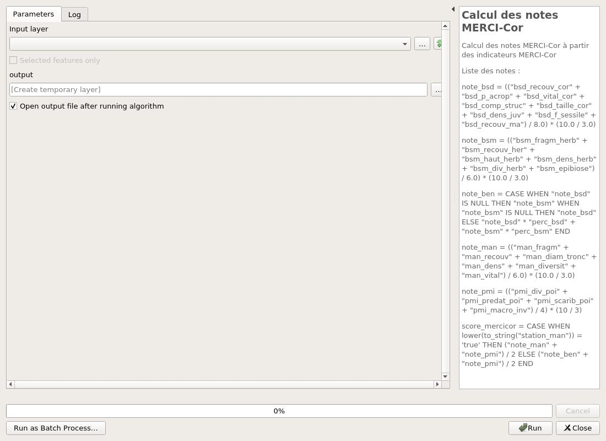
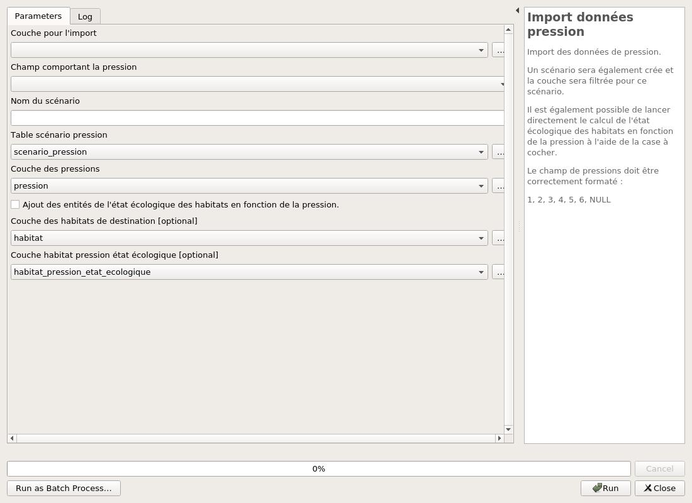

---
hide:
  - navigation
---

# Processing

## Calcul

### Calcul des notes MERCI-Cor

Calcul des notes MERCI-Cor à partir des indicateurs MERCI-Cor

Liste des notes :
note_bsd = (("bsd_recouv_cor" + "bsd_p_acrop" + "bsd_vital_cor" + "bsd_comp_struc" + "bsd_taille_cor" + "bsd_dens_juv" + "bsd_f_sessile" + "bsd_recouv_ma") / 8.0) * (10.0 / 3.0)
note_bsm = (("bsm_fragm_herb" + "bsm_recouv_her" + "bsm_haut_herb" + "bsm_dens_herb" + "bsm_div_herb" + "bsm_epibiose") / 6.0) * (10.0 / 3.0)
note_ben = "note_bsd" * "perc_bsd" + "note_bsm" * "perc_bsm"
note_man = (("man_fragm" + "man_recouv" + "man_diam_tronc" + "man_dens" + "man_diversit" + "man_vital") / 6.0) * (10.0 / 3.0)
note_pmi = (("pmi_div_poi" + "pmi_predat_poi" + "pmi_scarib_poi" + "pmi_macro_inv") / 4) * (10 / 3)
score_mercicor = CASE WHEN "station_man" THEN ("note_man" + "note_pmi") / 2 ELSE ("note_ben" + "note_pmi") / 2 END

#### Parameters

| ID | Description | Type | Info | Required | Advanced | Option |
|:-:|:-:|:-:|:-:|:-:|:-:|:-:|
INPUT|Input layer|FeatureSource||✓|||
OUTPUT|output|FeatureSink||✓||Type: TypeVector  |

#### Outputs

| ID | Description | Type | Info |
|:-:|:-:|:-:|:-:|
OUTPUT|output|VectorLayer||

***

### Calcul unicité habitat/faciès

Vérification des données des habitats.
Les champs nom et faciès doivent être unique par objet géographique.

#### Parameters

| ID | Description | Type | Info | Required | Advanced | Option |
|:-:|:-:|:-:|:-:|:-:|:-:|:-:|
INPUT|Couche habitat|VectorLayer||✓||Default: habitat   Type: TypeVectorPolygon  |
OUTPUT|Couche des habitat/faciès à unifier|FeatureSink||||Type: TypeVectorPoint  |

#### Outputs

| ID | Description | Type | Info |
|:-:|:-:|:-:|:-:|
OUTPUT|Couche des habitat/faciès à unifier|VectorLayer||
NUMBER_OF_UNIQUE|Nombre de couple habitat/faciès unique|Number||
NUMBER_OF_NON_UNIQUE|Nombre de couple habitat/faciès non unique|Number||

***

## Administration

### Créer le geopackage de la zone d'étude

Pour commencer une nouvelle zone d'étude, vous devez d'abord créer le geopackage.

#### Parameters

| ID | Description | Type | Info | Required | Advanced | Option |
|:-:|:-:|:-:|:-:|:-:|:-:|:-:|
FILE_GPKG|Fichier Geopackage|FileDestination||✓|||
PROJECT_NAME|Nom de la zone d'étude|String||✓|||
PROJECT_CRS|CRS du project|Crs||✓||Default: EPSG:2154   |
PROJECT_EXTENT|Emprise du projet|Extent||✓|||

#### Outputs

| ID | Description | Type | Info |
|:-:|:-:|:-:|:-:|
FILE_GPKG|Fichier Geopackage|File||
OUTPUT_LAYERS|Couches de sorties|MultipleLayers||

***

### Charger les styles

Charger les styles pour les différentes couches.

Les relations et les jointures vont également être chargés dans le projet.

#### Parameters

| ID | Description | Type | Info | Required | Advanced | Option |
|:-:|:-:|:-:|:-:|:-:|:-:|:-:|
PRESSURE_LAYER|Couche des pressions|VectorLayer||✓||Default: pression   Type: TypeVectorPolygon  |
HABITAT_LAYER|Couche des habitats|VectorLayer||✓||Default: habitat   Type: TypeVectorPolygon  |
PRESSURE_LIST_LAYER|Liste des types de pression|VectorLayer||✓||Default: liste_type_pression   Type: TypeVectorPolygon  |
OBSERVATIONS_LAYER|Couches des observations|VectorLayer||✓||Default: observations   Type: TypeVectorPoint  |
HABITAT_ETAT_ECOLOGIQUE_LAYER|Table des observations ramenées à l'habitat|VectorLayer||✓||Default: habitat_etat_ecologique   Type: TypeVectorPolygon  |
SCENARIO_PRESSION|Couche des scénario de pression|VectorLayer||✓||Default: scenario_pression   Type: TypeVectorPolygon  |
HABITAT_PRESSION_ETAT_ECOLOGIQUE|Couche du résultat de l'intersection entre les pressions et les habitats.|VectorLayer||✓||Default: habitat_pression_etat_ecologique   Type: TypeVectorPolygon  |

#### Outputs

| ID | Description | Type | Info |
|:-:|:-:|:-:|:-:|
RELATIONS_ADDED|Nombre de relations chargés|Number||
QML_LOADED|Nombre de QML chargés|Number||

***

## Export

### Télécharger le modèle des observations

Télécharger le modèle de fichier tableur pour les observations.

#### Parameters

| ID | Description | Type | Info | Required | Advanced | Option |
|:-:|:-:|:-:|:-:|:-:|:-:|:-:|
INPUT_LAYER|Couche des observations dans le geopackage|VectorLayer|Couche des observations dans le geopackage|✓||Default: observations   Type: TypeVectorPoint  |
INCLUDE_X_Y|Inclure des colonnes avec latitude/longitude|Boolean|Inclure des colonnes avec latitude/longitude|✓||Default: True   |
HABITAT_LAYER|Couche des habitats dans le geopackage|VectorLayer|Couche des habitats dans le geopackage|||Default: habitat   Type: TypeVectorPolygon  |
DESTINATION_FILE|Fichier tableur de destination|FileDestination|Fichier tableur de destination|✓|||

#### Outputs

| ID | Description | Type | Info |
|:-:|:-:|:-:|:-:|
DESTINATION_FILE|Fichier tableur de destination|File||

***

## Import

### Import données habitat

Import des données des habitats.
Le champ du faciès doit être correctement formaté.
Un style pour les habitats sera ajouté.

#### Parameters

| ID | Description | Type | Info | Required | Advanced | Option |
|:-:|:-:|:-:|:-:|:-:|:-:|:-:|
INPUT_LAYER|Couche pour l'import|VectorLayer||✓||Type: TypeVectorPolygon  |
NAME_FIELD|Champ comportant le nom de l'habitat|Field||✓|||
FACIES_FIELD|Champ comportant le faciès|Field||✓|||
OUTPUT_LAYER|Couche des habitats de destination|VectorLayer||✓||Default: habitat   Type: TypeVectorPolygon  |

#### Outputs

| ID | Description | Type | Info |
|:-:|:-:|:-:|:-:|
No output

***

### Import données observation

Import des données des observations.

L'algortihme peut soit mettre à jour des observations existantes ou alors les rajouter dans la table destinaton.
Pour cela, l'algorithme s'appuie sur le ID de la station.

#### Parameters

| ID | Description | Type | Info | Required | Advanced | Option |
|:-:|:-:|:-:|:-:|:-:|:-:|:-:|
INPUT_LAYER|Couche pour l'import des observations|VectorLayer||✓||Type: TypeVector  |
OUTPUT_LAYER|Couche des observations de destination|VectorLayer||✓||Default: observations   Type: TypeVectorPolygon  |

#### Outputs

| ID | Description | Type | Info |
|:-:|:-:|:-:|:-:|
No output

***

### Import données pression

Import des données de pression.

Le champ des pressions doit être correctement formaté : 
1, 2, 3, 4, 5, 6, NULL
Un scénario sera également crée et la couche sera filtrée pour ce scénario.

#### Parameters

| ID | Description | Type | Info | Required | Advanced | Option |
|:-:|:-:|:-:|:-:|:-:|:-:|:-:|
INPUT_LAYER|Couche pour l'import|VectorLayer||✓||Type: TypeVectorPolygon  |
PRESSURE_FIELD|Champ comportant la pression|Field||✓|||
SCENARIO_NAME|Nom du scénario|String|Le nom du scénario en cours pour cette couche des pressions.|✓|||
SCENARIO_LAYER|Couche des scénarios de destination|VectorLayer|La couche de destination des scénarios doit être la couche qui est dans le geopackage.|✓||Default: scenario_pression   Type: TypeVector  |
OUTPUT_LAYER|Couche des pressions de destination|VectorLayer||✓||Default: pression   Type: TypeVectorPolygon  |

#### Outputs

| ID | Description | Type | Info |
|:-:|:-:|:-:|:-:|
No output

***

