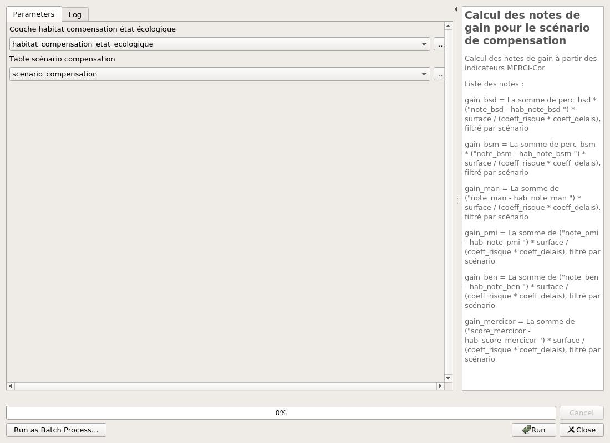
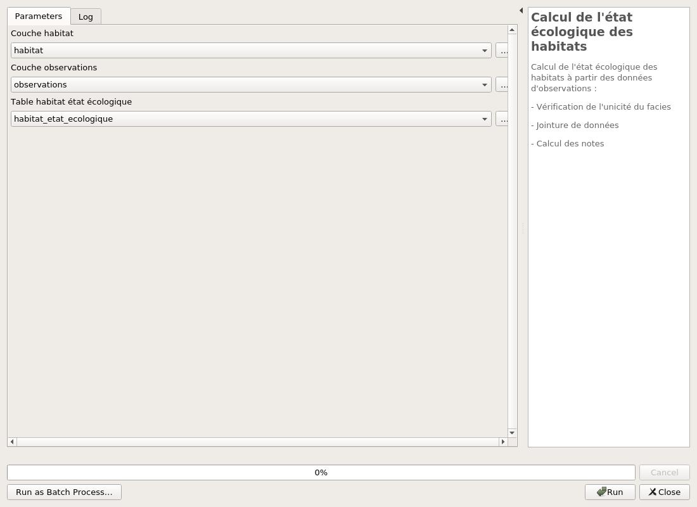
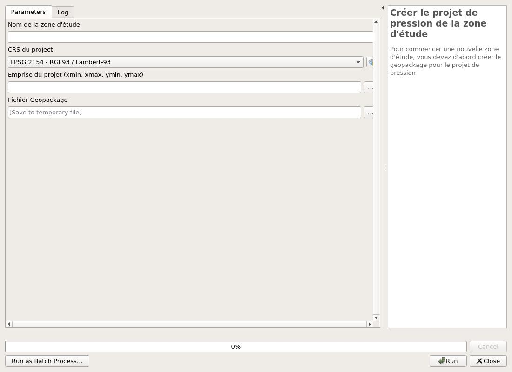
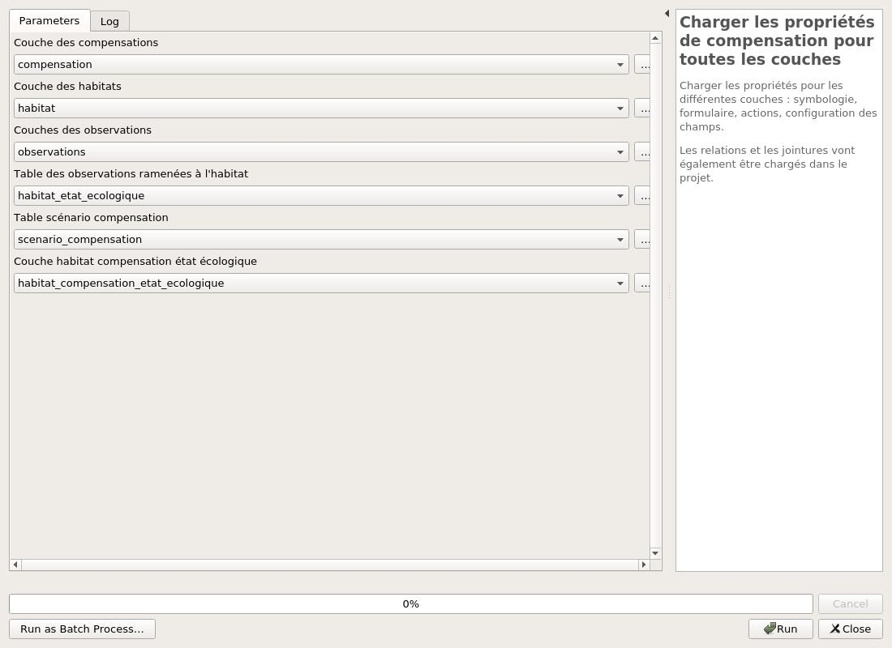

---
hide:
  - navigation
---

# Processing

## Calcul compensation

### Calcul des notes de gain pour le scénario de compensation

Calcul des notes de gain à partir des indicateurs MERCI-Cor

Liste des notes :

gain_bsd = La somme de perc_bsd * ("note_bsd - hab_note_bsd ") * surface / (coeff_risque * coeff_delais), filtré par scénario

gain_bsm = La somme de perc_bsm * ("note_bsm - hab_note_bsm ") * surface / (coeff_risque * coeff_delais), filtré par scénario

gain_man = La somme de ("note_man - hab_note_man ") * surface / (coeff_risque * coeff_delais), filtré par scénario

gain_pmi = La somme de ("note_pmi - hab_note_pmi ") * surface / (coeff_risque * coeff_delais), filtré par scénario

gain_ben = La somme de ("note_ben - hab_note_ben ") * surface / (coeff_risque * coeff_delais), filtré par scénario

gain_mercicor = La somme de ("score_mercicor - hab_score_mercicor ") * surface / (coeff_risque * coeff_delais), filtré par scénario

#### Parameters

| ID | Description | Type | Info | Required | Advanced | Option |
|:-:|:-:|:-:|:-:|:-:|:-:|:-:|
HABITAT_COMPENSATION_ETAT_ECOLOGIQUE|Couche habitat compensation état écologique|VectorLayer||✓||Default: habitat_compensation_etat_ecologique   Type: TypeVectorPolygon  |
SCENARIO_COMPENSATION|Table scénario compensation|VectorLayer||✓||Default: scenario_compensation   Type: TypeVectorAnyGeometry  |

#### Outputs

| ID | Description | Type | Info |
|:-:|:-:|:-:|:-:|
No output

***

### Ajout des entités de l'état écologique des habitats en fonction de la compensation

Ajout des entités de l'état écologique des habitats en fonction de la compensation.

#### Parameters

| ID | Description | Type | Info | Required | Advanced | Option |
|:-:|:-:|:-:|:-:|:-:|:-:|:-:|
HABITAT_LAYER|Couches des habitats|VectorLayer|Couche des habitats dans le geopackage|✓||Default: habitat   Type: TypeVectorPolygon  |
COMPENSATION_LAYER|Couche des compensations|VectorLayer|Couche des compensations|✓||Default: compensation   Type: TypeVectorPolygon  |
HABITAT_COMPENSATION_ETAT_ECOLOGIQUE_LAYER|Couche habitat compensation état écologique|VectorLayer|Couche habitat compensation état écologique|✓||Default: habitat_compensation_etat_ecologique   Type: TypeVectorPolygon  |

#### Outputs

| ID | Description | Type | Info |
|:-:|:-:|:-:|:-:|
No output

***

## Calcul

### Calcul de l'état écologique des habitats

Calcul de l'état écologique des habitats à partir des données d'observations :
- Vérification de l'unicité du facies
- Jointure de données
- Calcul des notes

#### Parameters

| ID | Description | Type | Info | Required | Advanced | Option |
|:-:|:-:|:-:|:-:|:-:|:-:|:-:|
HABITAT|Couche habitat|VectorLayer||✓||Default: habitat   Type: TypeVectorPolygon  |
OBSERVATIONS|Couche observations|VectorLayer||✓||Default: observations   Type: TypeVectorPoint  |
HABITAT_ETAT_ECOLOGIQUE|Table habitat état écologique|VectorLayer||✓||Default: habitat_etat_ecologique   Type: TypeVectorAnyGeometry  |

#### Outputs

| ID | Description | Type | Info |
|:-:|:-:|:-:|:-:|
No output

***

### Calcul des notes MERCI-Cor

Calcul des notes MERCI-Cor à partir des indicateurs MERCI-Cor

Liste des notes :

note_bsd = (("bsd_recouv_cor" + "bsd_p_acrop" + "bsd_vital_cor" + "bsd_comp_struc" + "bsd_taille_cor" + "bsd_dens_juv" + "bsd_f_sessile" + "bsd_recouv_ma") / 8.0) * (10.0 / 3.0)

note_bsm = (("bsm_fragm_herb" + "bsm_recouv_her" + "bsm_haut_herb" + "bsm_dens_herb" + "bsm_div_herb" + "bsm_epibiose") / 6.0) * (10.0 / 3.0)

note_ben = CASE WHEN "note_bsd" IS NULL THEN "note_bsm" WHEN "note_bsm" IS NULL THEN "note_bsd" ELSE "note_bsd" * "perc_bsd" + "note_bsm" * "perc_bsm" END

note_man = (("man_fragm" + "man_recouv" + "man_diam_tronc" + "man_dens" + "man_diversit" + "man_vital") / 6.0) * (10.0 / 3.0)

note_pmi = (("pmi_div_poi" + "pmi_predat_poi" + "pmi_scarib_poi" + "pmi_macro_inv") / 4) * (10 / 3)

score_mercicor = CASE WHEN lower(to_string("station_man")) = 'true' THEN ("note_man" + "note_pmi") / 2 ELSE ("note_ben" + "note_pmi") / 2 END

#### Parameters

| ID | Description | Type | Info | Required | Advanced | Option |
|:-:|:-:|:-:|:-:|:-:|:-:|:-:|
INPUT|Input layer|FeatureSource||✓|||
OUTPUT|output|FeatureSink||✓||Type: TypeVector  |

#### Outputs

| ID | Description | Type | Info |
|:-:|:-:|:-:|:-:|
OUTPUT|output|VectorLayer||

***

### Calcul unicité habitat/faciès

Vérification des données des habitats.
Les champs nom et faciès doivent être unique par objet géographique.

#### Parameters

| ID | Description | Type | Info | Required | Advanced | Option |
|:-:|:-:|:-:|:-:|:-:|:-:|:-:|
INPUT|Couche habitat|VectorLayer||✓||Default: habitat   Type: TypeVectorPolygon  |
OUTPUT|Couche des habitat/faciès à unifier|FeatureSink||||Type: TypeVectorPoint  |

#### Outputs

| ID | Description | Type | Info |
|:-:|:-:|:-:|:-:|
OUTPUT|Couche des habitat/faciès à unifier|VectorLayer||
NUMBER_OF_UNIQUE|Nombre de couple habitat/faciès unique|Number||
NUMBER_OF_NON_UNIQUE|Nombre de couple habitat/faciès non unique|Number||

***

## Calcul pression

### Ajout des entités de l'état écologique des habitats en fonction de la pression

Ajout des entités de l'état écologique des habitats en fonction de la pression.

#### Parameters

| ID | Description | Type | Info | Required | Advanced | Option |
|:-:|:-:|:-:|:-:|:-:|:-:|:-:|
HABITAT_LAYER|Couches des habitats|VectorLayer|Couche des habitats dans le geopackage|✓||Default: habitat   Type: TypeVectorPolygon  |
PRESSION_LAYER|Couche des pressions|VectorLayer|Couche des pressions|✓||Default: pression   Type: TypeVectorPolygon  |
HABITAT_PRESSION_ETAT_ECOLOGIQUE_LAYER|Couche habitat pression état écologique|VectorLayer|Couche habitat pression état écologique|✓||Default: habitat_pression_etat_ecologique   Type: TypeVectorPolygon  |

#### Outputs

| ID | Description | Type | Info |
|:-:|:-:|:-:|:-:|
No output

***

### Calcul des notes de perte pour le scénario de pression

Calcul des notes de perte à partir des indicateurs MERCI-Cor

Liste des notes :

perte_bsd = La somme de perc_bsd * ("hab_note_bsd - note_bsd ") * surface, filtré par scénario

perte_bsm = La somme de perc_bsm * ("hab_note_bsm - note_bsm ") * surface, filtré par scénario

perte_man = La somme de ("hab_note_man - note_man ") * surface, filtré par scénario

perte_pmi = La somme de ("hab_note_pmi - note_pmi ") * surface, filtré par scénario

perte_ben = La somme de ("hab_note_ben - note_ben ") * surface, filtré par scénario

perte_mercicor = La somme de ("hab_score_mercicor - score_mercicor ") * surface, filtré par scénario

#### Parameters

| ID | Description | Type | Info | Required | Advanced | Option |
|:-:|:-:|:-:|:-:|:-:|:-:|:-:|
HABITAT_PRESSION_ETAT_ECOLOGIQUE|Couche habitat pression état écologique|VectorLayer||✓||Default: habitat_pression_etat_ecologique   Type: TypeVectorPolygon  |
SCENARIO_PRESSION|Table scénario pression|VectorLayer||✓||Default: scenario_pression   Type: TypeVectorAnyGeometry  |

#### Outputs

| ID | Description | Type | Info |
|:-:|:-:|:-:|:-:|
No output

***

## Administration

### Créer le projet de compensation de la zone d'étude

Pour commencer une nouvelle zone d'étude, vous devez d'abord créer le geopackage pour le projet de compensation

#### Parameters

| ID | Description | Type | Info | Required | Advanced | Option |
|:-:|:-:|:-:|:-:|:-:|:-:|:-:|
FILE_GPKG|Fichier Geopackage|FileDestination||✓|||
PROJECT_NAME|Nom de la zone d'étude|String||✓|||
PROJECT_CRS|CRS du project|Crs||✓||Default: EPSG:2154   |
PROJECT_EXTENT|Emprise du projet|Extent||✓|||

#### Outputs

| ID | Description | Type | Info |
|:-:|:-:|:-:|:-:|
FILE_GPKG|Fichier Geopackage|File||
OUTPUT_LAYERS|Couches de sorties|MultipleLayers||

***

### Créer le projet de pression de la zone d'étude

Pour commencer une nouvelle zone d'étude, vous devez d'abord créer le geopackage pour le projet de pression

#### Parameters

| ID | Description | Type | Info | Required | Advanced | Option |
|:-:|:-:|:-:|:-:|:-:|:-:|:-:|
FILE_GPKG|Fichier Geopackage|FileDestination||✓|||
PROJECT_NAME|Nom de la zone d'étude|String||✓|||
PROJECT_CRS|CRS du project|Crs||✓||Default: EPSG:2154   |
PROJECT_EXTENT|Emprise du projet|Extent||✓|||

#### Outputs

| ID | Description | Type | Info |
|:-:|:-:|:-:|:-:|
FILE_GPKG|Fichier Geopackage|File||
OUTPUT_LAYERS|Couches de sorties|MultipleLayers||

***

### Charger les propriétés de compensation pour toutes les couches

Charger les propriétés pour les différentes couches : symbologie, formulaire, actions, configuration des champs.

Les relations et les jointures vont également être chargés dans le projet.

#### Parameters

| ID | Description | Type | Info | Required | Advanced | Option |
|:-:|:-:|:-:|:-:|:-:|:-:|:-:|
COMPENSATION_LAYER|Couche des compensations|VectorLayer||✓||Default: compensation   Type: TypeVectorPolygon  |
HABITAT_LAYER|Couche des habitats|VectorLayer||✓||Default: habitat   Type: TypeVectorPolygon  |
OBSERVATIONS_LAYER|Couches des observations|VectorLayer||✓||Default: observations   Type: TypeVectorPoint  |
HABITAT_ETAT_ECOLOGIQUE_LAYER|Table des observations ramenées à l'habitat|VectorLayer||✓||Default: habitat_etat_ecologique   Type: TypeVectorPolygon  |
SCENARIO_COMPENSATION|Table scénario compensation|VectorLayer||✓||Default: scenario_compensation   Type: TypeVectorPolygon  |
HABITAT_COMPENSATION_ETAT_ECOLOGIQUE|Couche habitat compensation état écologique|VectorLayer||✓||Default: habitat_compensation_etat_ecologique   Type: TypeVectorPolygon  |

#### Outputs

| ID | Description | Type | Info |
|:-:|:-:|:-:|:-:|
JOINS_ADDED|Nombre de jointures chargées|Number||
ACTIONS_ADDED|Nombre d'actions chargées|Number||
RELATIONS_ADDED|Nombre de relations chargées|Number||
QML_LOADED|Nombre de QML chargés|Number||

***

### Charger les propriétés de pression pour toutes les couches

Charger les propriétés pour les différentes couches : symbologie, formulaire, actions, configuration des champs.

Les relations et les jointures vont également être chargés dans le projet.

#### Parameters

| ID | Description | Type | Info | Required | Advanced | Option |
|:-:|:-:|:-:|:-:|:-:|:-:|:-:|
PRESSION_LAYER|Couche des pressions|VectorLayer||✓||Default: pression   Type: TypeVectorPolygon  |
HABITAT_LAYER|Couche des habitats|VectorLayer||✓||Default: habitat   Type: TypeVectorPolygon  |
OBSERVATIONS_LAYER|Couches des observations|VectorLayer||✓||Default: observations   Type: TypeVectorPoint  |
HABITAT_ETAT_ECOLOGIQUE_LAYER|Table des observations ramenées à l'habitat|VectorLayer||✓||Default: habitat_etat_ecologique   Type: TypeVectorPolygon  |
SCENARIO_PRESSION|Table scénario pression|VectorLayer||✓||Default: scenario_pression   Type: TypeVectorPolygon  |
HABITAT_PRESSION_ETAT_ECOLOGIQUE|Couche habitat pression état écologique|VectorLayer||✓||Default: habitat_pression_etat_ecologique   Type: TypeVectorPolygon  |
PRESSURE_LIST_LAYER|Liste des types de pression|VectorLayer||✓||Default: liste_type_pression   Type: TypeVectorPolygon  |

#### Outputs

| ID | Description | Type | Info |
|:-:|:-:|:-:|:-:|
JOINS_ADDED|Nombre de jointures chargées|Number||
ACTIONS_ADDED|Nombre d'actions chargées|Number||
RELATIONS_ADDED|Nombre de relations chargées|Number||
QML_LOADED|Nombre de QML chargés|Number||

***

## Export

### Télécharger le modèle des observations

Télécharger le modèle de fichier tableur pour les observations.

#### Parameters

| ID | Description | Type | Info | Required | Advanced | Option |
|:-:|:-:|:-:|:-:|:-:|:-:|:-:|
INPUT_LAYER|Couche des observations dans le geopackage|VectorLayer|Couche des observations dans le geopackage|✓||Default: observations   Type: TypeVectorPoint  |
INCLUDE_X_Y|Inclure des colonnes avec latitude/longitude|Boolean|Inclure des colonnes avec latitude/longitude|✓||Default: True   |
HABITAT_LAYER|Couche des habitats dans le geopackage|VectorLayer|Couche des habitats dans le geopackage|||Default: habitat   Type: TypeVectorPolygon  |
DESTINATION_FILE|Fichier tableur de destination|FileDestination|Fichier tableur de destination|✓|||

#### Outputs

| ID | Description | Type | Info |
|:-:|:-:|:-:|:-:|
DESTINATION_FILE|Fichier tableur de destination|File||

***

## Import

### Import données compensation

Import des données de compensation.

Un scénario sera également crée et la couche sera filtrée pour ce scénario.
Il est également possible de lancer directement le calcul de l'état écologique des habitats en fonction de la compensation à l'aide de la case à cocher.

#### Parameters

| ID | Description | Type | Info | Required | Advanced | Option |
|:-:|:-:|:-:|:-:|:-:|:-:|:-:|
INPUT_LAYER|Couche pour l'import|VectorLayer||✓||Type: TypeVectorPolygon  |
COMPENSATION_FIELD|Champ comportant la compensation|Field||✓|||
SCENARIO_NAME|Nom du scénario|String|Le nom du scénario en cours pour cette couche de compensation.|✓|||
SCENARIO_LAYER|Table scénario compensation|VectorLayer|La couche de destination des scénarios doit être la couche qui est dans le geopackage.|✓||Default: scenario_compensation   Type: TypeVector  |
OUTPUT_LAYER|Couche des compensations|VectorLayer||✓||Default: compensation   Type: TypeVectorPolygon  |
APPLY_CALCUL_HABITAT_COMPENSATION_ETAT_ECOLOGIQUE|Ajout des entités de l'état écologique des habitats en fonction de la compensation.|Boolean||✓|||
HABITAT_LAYER|Couche des habitats de destination|VectorLayer||||Default: habitat   Type: TypeVectorPolygon  |
HABITAT_COMPENSATION_LAYER|Couche habitat compensation état écologique|VectorLayer||||Default: habitat_compensation_etat_ecologique   Type: TypeVectorPolygon  |
RISQUE_COEFFICIENT_CHAMP|Champ comportant le coefficient de risque|Field||✓|||
DELAIS_COEFFICIENT_CHAMP|Champ comportant le coefficient de délais|Field||✓|||

#### Outputs

| ID | Description | Type | Info |
|:-:|:-:|:-:|:-:|
No output

***

### Import données habitat

Import des données des habitats.
Le champ du faciès doit être correctement formaté.
Un style pour les habitats sera ajouté.

#### Parameters

| ID | Description | Type | Info | Required | Advanced | Option |
|:-:|:-:|:-:|:-:|:-:|:-:|:-:|
INPUT_LAYER|Couche pour l'import|VectorLayer||✓||Type: TypeVectorPolygon  |
NAME_FIELD|Champ comportant le nom de l'habitat|Field||✓|||
FACIES_FIELD|Champ comportant le faciès|Field||✓|||
OUTPUT_LAYER|Couche des habitats de destination|VectorLayer||✓||Default: habitat   Type: TypeVectorPolygon  |

#### Outputs

| ID | Description | Type | Info |
|:-:|:-:|:-:|:-:|
No output

***

### Import données observation

Import des données des observations.

L'algortihme peut soit mettre à jour des observations existantes ou alors les rajouter dans la table destinaton.
Pour cela, l'algorithme s'appuie sur le ID de la station.

#### Parameters

| ID | Description | Type | Info | Required | Advanced | Option |
|:-:|:-:|:-:|:-:|:-:|:-:|:-:|
INPUT_LAYER|Couche pour l'import des observations|VectorLayer||✓||Type: TypeVector  |
OUTPUT_LAYER|Couche des observations de destination|VectorLayer||✓||Default: observations   Type: TypeVectorPoint  |

#### Outputs

| ID | Description | Type | Info |
|:-:|:-:|:-:|:-:|
No output

***

### Import données pression

Import des données de pression.

Un scénario sera également crée et la couche sera filtrée pour ce scénario.
Il est également possible de lancer directement le calcul de l'état écologique des habitats en fonction de la pression à l'aide de la case à cocher.

Le champ de pressions doit être correctement formaté : 
1, 2, 3, 4, 5, 6, NULL

#### Parameters

| ID | Description | Type | Info | Required | Advanced | Option |
|:-:|:-:|:-:|:-:|:-:|:-:|:-:|
INPUT_LAYER|Couche pour l'import|VectorLayer||✓||Type: TypeVectorPolygon  |
PRESSION_FIELD|Champ comportant la pression|Field||✓|||
SCENARIO_NAME|Nom du scénario|String|Le nom du scénario en cours pour cette couche de pression.|✓|||
SCENARIO_LAYER|Table scénario pression|VectorLayer|La couche de destination des scénarios doit être la couche qui est dans le geopackage.|✓||Default: scenario_pression   Type: TypeVector  |
OUTPUT_LAYER|Couche des pressions|VectorLayer||✓||Default: pression   Type: TypeVectorPolygon  |
APPLY_CALCUL_HABITAT_PRESSION_ETAT_ECOLOGIQUE|Ajout des entités de l'état écologique des habitats en fonction de la pression.|Boolean||✓|||
HABITAT_LAYER|Couche des habitats de destination|VectorLayer||||Default: habitat   Type: TypeVectorPolygon  |
HABITAT_PRESSION_LAYER|Couche habitat pression état écologique|VectorLayer||||Default: habitat_pression_etat_ecologique   Type: TypeVectorPolygon  |

#### Outputs

| ID | Description | Type | Info |
|:-:|:-:|:-:|:-:|
No output

***

