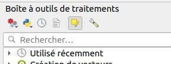

# Calcul de l'état écologique des habitats

## Mise en place de la couche habitat

Dans un premier temps, il faut travailler sur la couche habitat pour définir des faciès. Pour cela il faut
remplir le champ faciès des entités dans lesquelles il est vide.

Puis il faut sélectionner l'habitat sur lequel on souhaite travailler.

Puis on divise les différentes parties avec l'algorithme **De morceaux multiples à morceaux uniques** en mode
`édition sur place`.

!!! tip
    L'édition sur place signifie de cliquer un bouton de la boîte à outils QGIS (cf. l'image ci-dessous). L'algorithme
    se lancera sans l'apparition d'une fenêtre et effectuera les modifications directement dans la couche 
    en question en prenant en compte les éléments sélectionnés dans votre QGIS

<!--
utilisation des outils de découpe split features.
Enfin il faut modifier les faciès des nouvelles entités.
-->

## Vérification de l'unicité

Il faut vérifier l'unicité habitat via l'algorithme **Calcul unicité habitat/faciès**. Avec la couche
multipoint de sortie, sélectionner les objets à fusionner et les fusionner.

## Calcul de l'état écologique des habitats

Une fois les données d'habitat et d'observation intégrées, le calcul de l'état écologique des habitats peut être fait via
l'algorithme **Calcul état écologique des habitats**.

 

Cet algorithme va exécuter 3 étapes automatiquement :

* Il utilise l'algorithme mercicor de vérification de l'unicité du champ `faciès` pour la couche habitat
* Ensuite il va faire une intersection de données via l'algorithme QGIS de **Jointure d'attribut par localisation**
* Puis il calcule les notes via l'algorithme mercicor de calcul des notes
