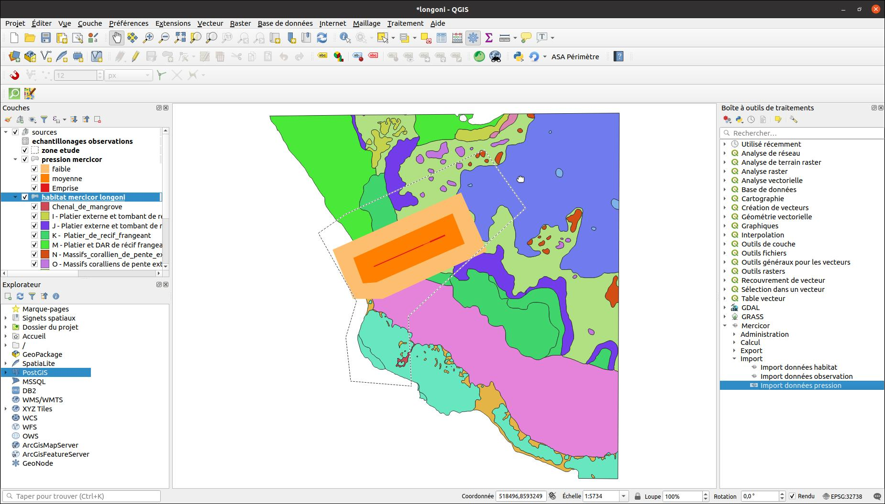
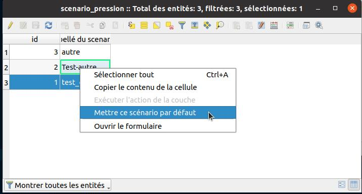

---
hide:
  - toc
---

# Étude des scénarios de pressions

Intégration de données de pression via l'algorithme d'import :

Il demande en paramètre :

* le fichier contenant les données
* le champ identifiant
* le nom du scénario
* la couche qui contient les scénarios
* la couche qui contient les donnée de pressions

Exemple de données après import

Ensuite il faut saisir les indicateurs suite aux pressions, puis faire un calcul des notes Mercicor en 
utilisant le même algorithme que pour les calculs précédents concernant les observations mais il faut 
lui renseigner la couche concernant les études des scénarios de pression.

!!! tip
    Une correction automatique des géométries est faite lors de l'import.

## Gestion des scénarios

L'import des données pressions déclenche l'ajout d'une nouvelle ligne dans la table des scénarios.

Dans la table attributaire de la couche scénario, on peut faire un clic-droit sur une entité pour basculer
d'un scénario à un autre. Cela filtre les couches qui en dépendent :

* Pression
* Habitat pression état écologique

Dans le menu clic-droit il faut sélectionner l'action **Mettre ce scénario par défaut**

