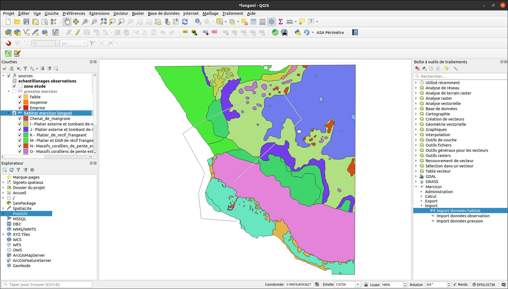

# Données d'habitats

## Import dans le projet

<!-- faire un laius sur nom/faciès -> unicité des objets multipolygone dans la zone d'étude -->

!!! tip
    Une correction automatique des géométries est faite lors de l'import.

Exemple de données après import

## Vérification de l'unicité nom/faciès

Un algorithme permet de vérifier l'unicité des couples nom/faciès.

Il en résulte une couche vectorielle ponctuelle qu'il faut vérifier.

