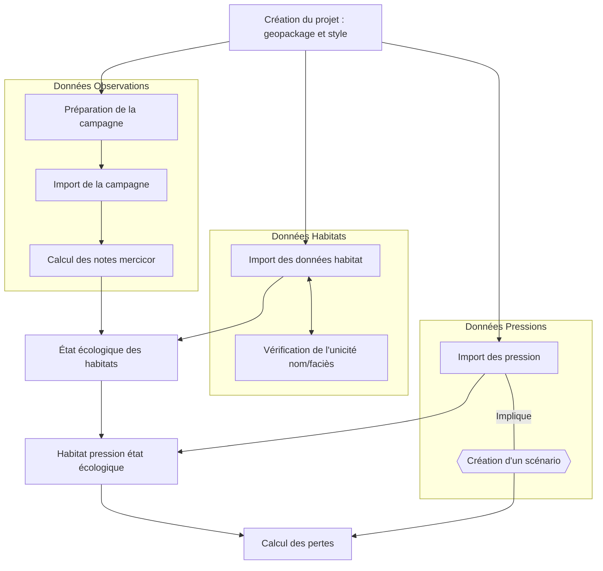
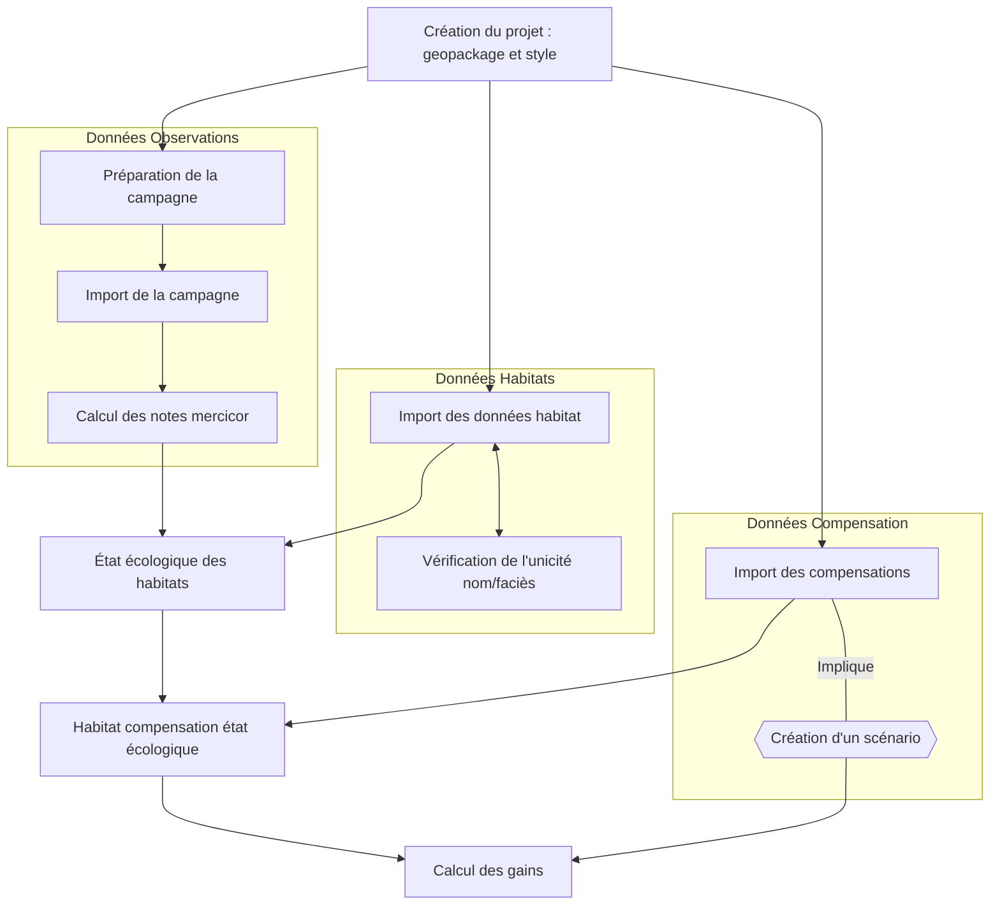
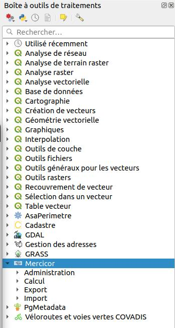

# Guide d'utilisation

## Déroulement

Une fois [installé](./installation.md), pour utiliser l'outil, il faut se rendre dans la boîte à outils de traitements de QGIS.

Il y a plusieurs étapes : 

* [Création du projet](./initialisation-projet.md)
* [Import des données habitats](./import-donnees-habitats.md)
* [Préparation de la campagne d'observations](./preparation-observations.md)
* [Intégration des données d'observations](./integration-campagne.md)
* [Calcul de l'état écologique des habitats](./calcul-etat-ecologique.md)
* [Étude des scénarios](./etude-scenario.md)
* [Habitat pression état écologique](./habitat-pression-etat-ecologique.md)
* [Pertes](./pertes.md)

## Diagramme

### Projet de pression

### Projet de compensation

