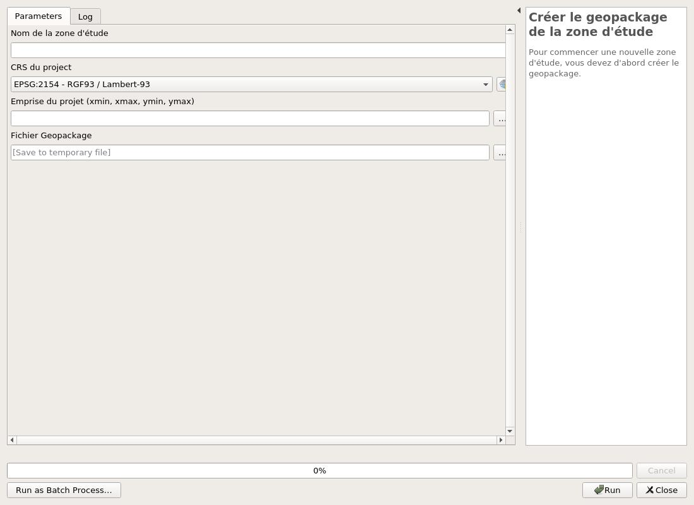

---
hide:
  - toc
---

# Création d'un projet

La création d'un nouveau projet via l'extension permet de générer un projet vide sans devoir le créer 
à la main et y ajoute toutes les couches nécessaires en les enregistrant dans un fichier geopackage.

Cela permet aussi de choisir l'emprise, le système de coordonnées et d'ajouter les styles prévus par l'extension.

Pour cette partie il y a deux algorithmes :

* En premier, celui nommé **Créer le geopackage de la zone d'étude**. Il demande les paramètres suivants :
    * le nom du projet
    * le système de coordonnées
    * l'emprise
    * Le dossier de destination pour le fichier geopackage

Après utilisation, un projet sur notre QGIS s'est crée avec toutes les couches.

* Le second s'appelle **Charger les styles**. Il prend en paramètre les différentes couches du projet afin d'ajouter les styles.

