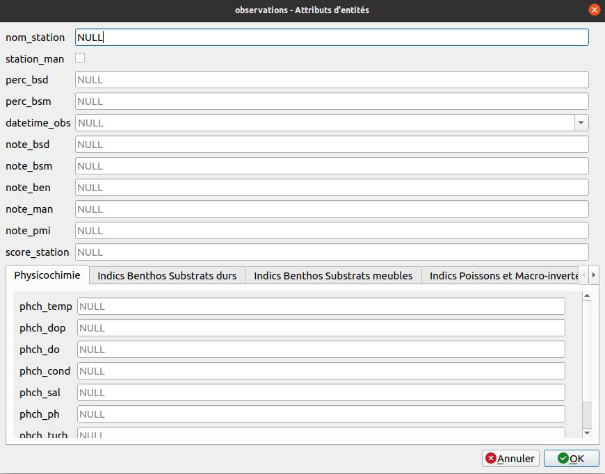
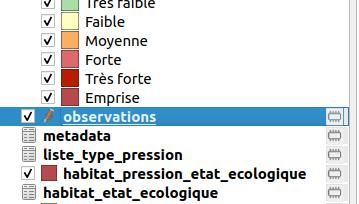
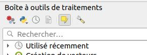

# Données d'observation

## Intégration des données

### Saisie manuelle

On peut utiliser la saisie dans QGIS via le formulaire d'édition pour l'ajout d'observation :

!!! tip
    Pour la consultation dans la table attributaire, ne pas oublier de passer en mode "Formulaire".

### Import de fichier tableur

On peut aussi importer un fichier Excel.

!!! tip
    Concernant le champ `station_man`, le champ doit être reconnu comme un booléen, avec les valeurs à droite
    ou au centre dans un tableur. Les champs à gauche sont du texte.

!!! tip
    On peut ouvrir une feuille Excel dans QGIS, comme une couche tabulaire, sans géométrie.
    Ce fichier s'ouvre comme une couche "vecteur".

## Calcul des notes Merci-Cor

Enfin pour le calcul des notes Merci-cor des observations et calcul de l'état écologique des habitats, 
un algorithme y est dédié.

Il y deux façons de l'utiliser :

* Première façon. Comme tout autre algorithme on le lance, rempli les paramètres puis on l'exécute. Il faut lui renseigner :
    * la couche sur laquelle on effectue les calculs
    * Si l'algorithme effectue les calculs uniquement sur les entités sélectionnées ou pas
    * Si on veut exporter le résultat dans une couche
    * puis si l'on veut ajouter la couche résultat au projet

* Deuxième façon. On sélectionne la couche dans l'arbre des couches et on entre en mode éditions (image 1 ci-dessous), dans la 
boîte à outils on clique sur `Editer les entités sur place` (bouton sélectionné sur l'image 2 ci-dessous), 
puis on exécute l'algorithme. 

!!! tip
    Si l'on souhaite l'exécuter uniquement sur certaines entités il faut les sélectionner avant
    l'exécution de l'algorithme.

!!! note
    Contrairement à une exécution normale ici aucune boîte de dialogue n'apparaît.

 
