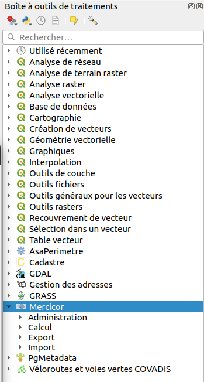
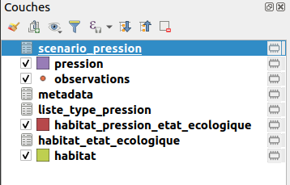
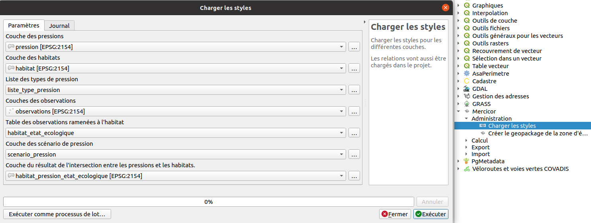
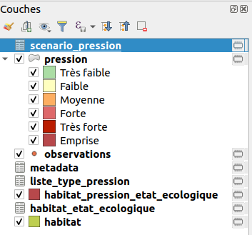
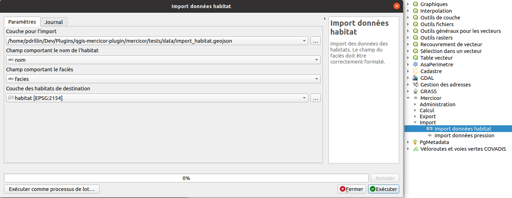
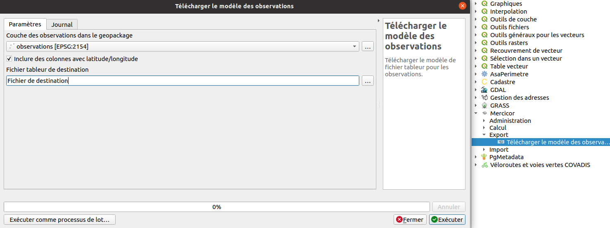
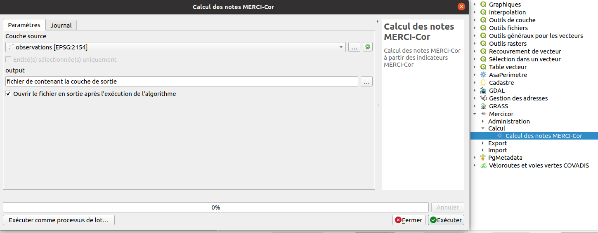
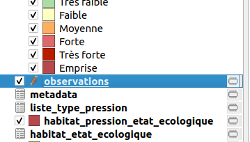
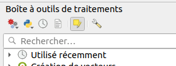

# Guide d'utilisation du plugin Mercicor

Une foie installer pour l'utiliser le plugin ce situ dans la barre d'outils QGIS:

## Création d'un projet :

La création d'un nouveau projet via le plugin permet de générer un projet vide sans devoir le créer 
à la main et y ajoute toutes les couches nécessaires en les enregistrants dans un fichier geopackage, 
cela permet aussi de choisir l'emprise ainsi que le système de coordonnées et de leurs ajouter les 
styles prévus par le plugin.

Pour cette partie il y a deux algorithmes :
* En premier celui nommé **Créer le geopackage de la zone d'étude** :
Il demande les paramètres suivants :
  * le nom du projet
  * le système de coordonnées
  * l'emprise
  * Le dossier de destination pour le fichier geopackage

Après utilisation un projet sur notre QGIS c'est créer avec toutes les couches.

* Le second s'appelle **Charger les styles** :
Il prend en paramètre les différentes couches du projet.

Et leurs appliques les différents styles proposés par le plugin.

## Import des données d'habitat :

faire un laius sur nom/faciès -> unicité des objets multipolygone dans la zone d'étude

## Préparation de la campagne d'observations :

Export Excel ou dessin des stations et Export Excel

## Intégration des données de la campagne d'observations :

Concernant l'intégration des données d'observations on fait soit une saisie via QGIS et le formulaire 
pour l'ajout d'observation :

Soit par l'import fichier Excel.
Enfin pour le calcul des notes Merci-cor des observations et calcul de l'état écologique des habitats
où un algorithme y est dédié.
Il y deux façons de l'utiliser:
* Première façon :
Comme tout autre algorithme on le lance, rempli les paramètres puis on l'exécute.

Il faut lui renseigner:
  * la couche sur laquelle on effectue les calculs
  * Si l'algorithme effectue les calculs uniquement sur les entités sélectionnées ou pas
  * Si on veut exporter le résultat dans une couche
  * puis si l'on veut ajouter la couche résultat au projet

* Deuxième façon :
On sélectionne la couche dans l'arbre des couches et on entre en mode éditions (image 1 ci-dessous), dans la 
boîte à outilson clique sur `Editer les entités sur place` (bouton sélectionné sur l'image 2 ci-dessous), 
puis on exécute l'algorithme. Si l'on souhaite l'exécuter uniquement sur certaines entités il faut les 
sélectionner avant l'exécution de l'algorithme.
 
Contrairement à une exécution normale ici aucune boîte de dialogue n'apparaît.

## Etudes des scénarios de pressions :

Intégration de données de pression via l'algorithme d'import :

il demande en paramètre:
* le fichier contenant les données
* le champ identifiant
* le nom du scénario
* la couche qui contient les scénarios
* la couche qui contient les donnée de pressions

Ensuite il faut saisir les indicateurs suite aux pressions, Puis faire un calculs des notes Mercicor en 
utilisant le même algorithme que pour pour les calculs précédent concernant les observations mais il faut 
lui renseigner la couche concernant les études des scénarios de pression.
