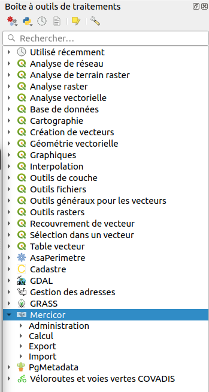
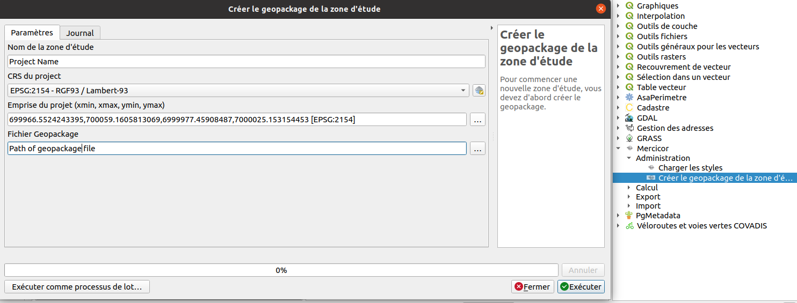
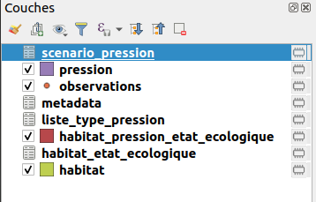
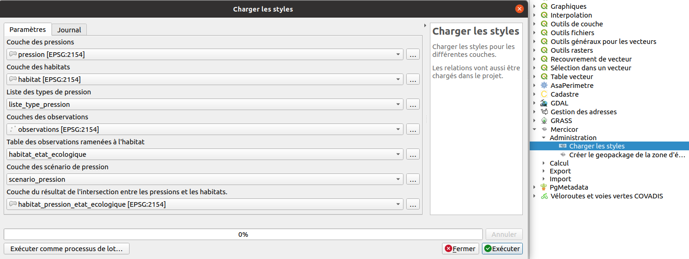
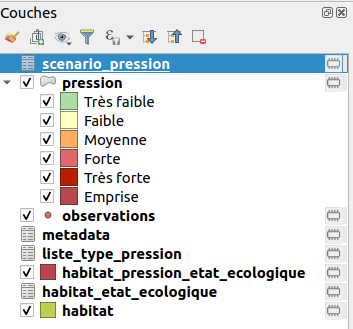
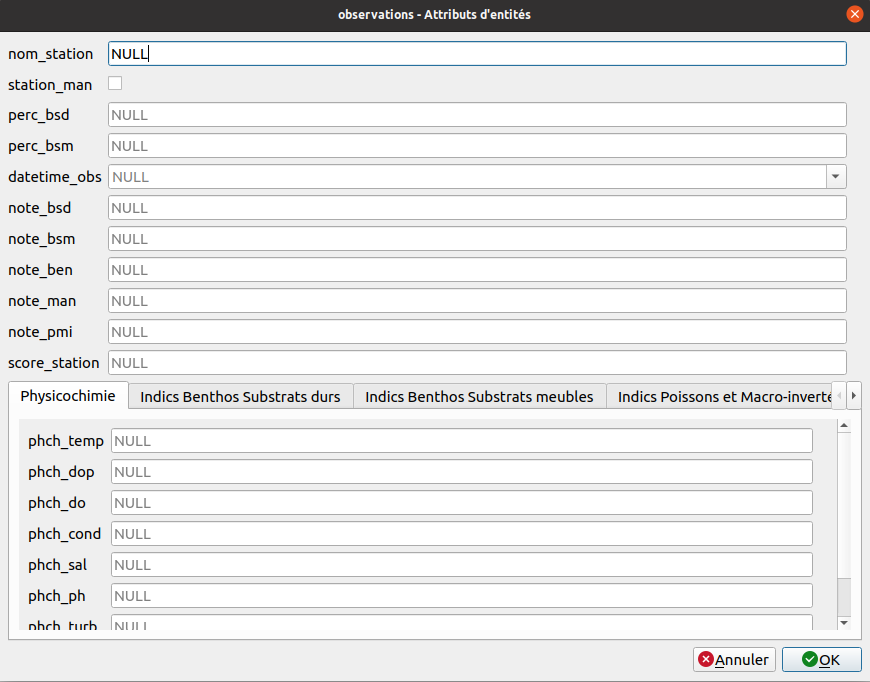
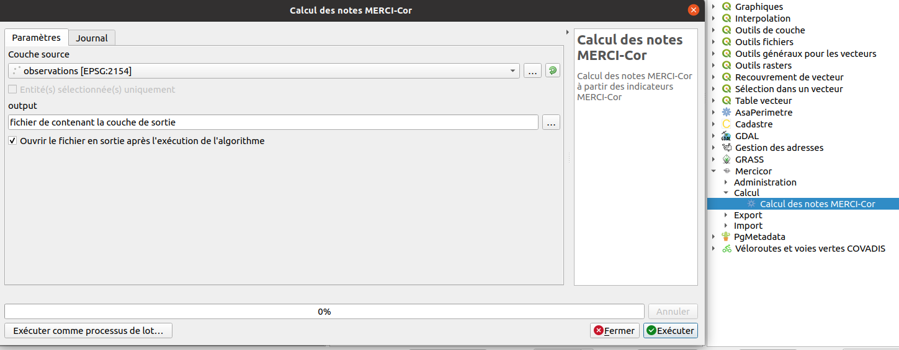
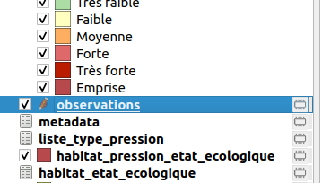
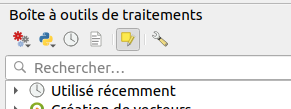
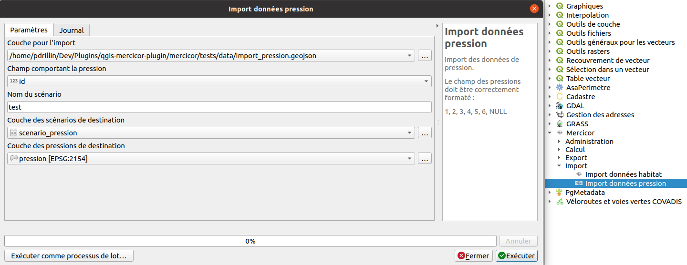

# Guide d'utilisation

Une fois installé pour l'utiliser le plugin se situe dans la barre d'outils QGIS :

## Création d'un projet

La création d'un nouveau projet via l'extension permet de générer un projet vide sans devoir le créer 
à la main et y ajoute toutes les couches nécessaires en les enregistrant dans un fichier geopackage.

Cela permet aussi de choisir l'emprise, le système de coordonnées et d'ajouter les styles prévus par l'extension.

Pour cette partie il y a deux algorithmes :

* En premier, celui nommé **Créer le geopackage de la zone d'étude**. Il demande les paramètres suivants :
    * le nom du projet
    * le système de coordonnées
    * l'emprise
    * Le dossier de destination pour le fichier geopackage

Après utilisation, un projet sur notre QGIS s'est crée avec toutes les couches.

* Le second s'appelle **Charger les styles**. Il prend en paramètre les différentes couches du projet afin d'ajouter les styles.

## Import des données d'habitat

faire un laius sur nom/faciès -> unicité des objets multipolygone dans la zone d'étude

## Préparation de la campagne d'observations

Export Excel ou dessin des stations et Export Excel

## Intégration des données de la campagne d'observations

Concernant l'intégration des données d'observations on fait soit une saisie via QGIS et le formulaire 
pour l'ajout d'observation :

Soit par l'import fichier Excel.

Enfin pour le calcul des notes Merci-cor des observations et calcul de l'état écologique des habitats
où un algorithme y est dédié.

Il y deux façons de l'utiliser :

* Première façon. Comme tout autre algorithme on le lance, rempli les paramètres puis on l'exécute. Il faut lui renseigner :
    * la couche sur laquelle on effectue les calculs
    * Si l'algorithme effectue les calculs uniquement sur les entités sélectionnées ou pas
    * Si on veut exporter le résultat dans une couche
    * puis si l'on veut ajouter la couche résultat au projet

* Deuxième façon. On sélectionne la couche dans l'arbre des couches et on entre en mode éditions (image 1 ci-dessous), dans la 
boîte à outils on clique sur `Editer les entités sur place` (bouton sélectionné sur l'image 2 ci-dessous), 
puis on exécute l'algorithme. Si l'on souhaite l'exécuter uniquement sur certaines entités il faut les 
sélectionner avant l'exécution de l'algorithme.

!!! note
    Contrairement à une exécution normale ici aucune boîte de dialogue n'apparaît.

 

## Études des scénarios de pressions

Intégration de données de pression via l'algorithme d'import :

Il demande en paramètre :

* le fichier contenant les données
* le champ identifiant
* le nom du scénario
* la couche qui contient les scénarios
* la couche qui contient les donnée de pressions

Ensuite il faut saisir les indicateurs suite aux pressions, puis faire un calcul des notes Mercicor en 
utilisant le même algorithme que pour les calculs précédents concernant les observations mais il faut 
lui renseigner la couche concernant les études des scénarios de pression.
